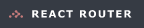
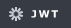
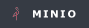

#  ONDE (여행 플랫폼 · 타깃 시스템)

## 💻 Developers

| <a href="https://github.com/nirey-l" target="_blank"></a> | <a href="https://github.com/Eojinn" target="_blank"></a> | <a href="https://github.com/Hyeonseok93" target="_blank"></a> | <a href="https://github.com/pjcosmos" target="_blank"></a> | <a href="https://github.com/yoojisoo99" target="_blank"></a> | <a href="https://github.com/JangSeonguk1011" target="_blank"></a> | <a href="https://github.com/hongjiho5148" target="_blank"></a> |
| :----------------------------------------------------------------------------------------------------------------------------: | :--------------------------------------------------------------------------------------------------------------------------: | :------------------------------------------------------------------------------------------------------------------------------------: | :------------------------------------------------------------------------------------------------------------------------------: | :----------------------------------------------------------------------------------------------------------------------------------: | :--------------------------------------------------------------------------------------------------------------------------------------------: | :--------------------------------------------------------------------------------------------------------------------------------------------: |
|                                           [이예린(팀장)](https://github.com/nirey-l)                                           |                                             [김어진](https://github.com/Eojinn)                                              |                                                [김현석](https://github.com/Hyeonseok93)                                                |                                              [박진아](https://github.com/pjcosmos)                                               |                                               [유지수](https://github.com/yoojisoo99)                                                |                                                  [장성욱](https://github.com/JangSeonguk1011)                                                  |                                                  [홍지호](https://github.com/hongjiho5148)                                                  |

---

> [!NOTE]
> **SK쉴더스 루키즈 5기** 최종 프로젝트에서, 취약점 진단·모의해킹의 **실증 대상(타깃)** 으로 올린 여행 플랫폼입니다. ARGUS는 이 대상을 검사하는 진단 플랫폼입니다.

## 🚀 Overview

바이브 코딩은 서비스를 빨리 올리지만, 화면이 열린다고 해서 안전한 것은 아닙니다. **ONDE**는 숙소·항공·렌터카·보험을 한 흐름에서 검색·예약·결제까지 이어 가며, 실제로 취약점이 생길 수 있는 API·화면을 갖춘 **여행 예약 플랫폼**입니다.

React에서 고객 포털과 판매자/관리자 백오피스를 제공하고, Spring Boot가 **회원·숙소·항공·렌터카·보험·결제·정산**을 도메인별로 처리합니다. 항공 좌석은 Redis 홀드로 잠시 잡고, 결제는 Wallet **prepare → validate**로 서버 금액을 고정하며, 숙소·렌터카는 날짜별 재고 달력으로 요금·재고를 맞춥니다.

**검색 → 예약(홀드) → 결제 → 마이페이지 / 셀러·어드민 운영** 흐름 위에 JWT(HttpOnly 쿠키) 인증, MinIO·S3 이미지, AWS·Terraform·GitHub Actions 배포를 붙여 둔 여행 서비스입니다.

---

## 🛠 Built With

<p>
<picture>
  <source media="(prefers-color-scheme: dark)" srcset=".github/readme/badges/dark/typescript.png">
  <source media="(prefers-color-scheme: light)" srcset=".github/readme/badges/light/typescript.png">
  
</picture>
<picture>
  <source media="(prefers-color-scheme: dark)" srcset=".github/readme/badges/dark/react.png">
  <source media="(prefers-color-scheme: light)" srcset=".github/readme/badges/light/react.png">
  
</picture>
<picture>
  <source media="(prefers-color-scheme: dark)" srcset=".github/readme/badges/dark/vite.png">
  <source media="(prefers-color-scheme: light)" srcset=".github/readme/badges/light/vite.png">
  
</picture>
<picture>
  <source media="(prefers-color-scheme: dark)" srcset=".github/readme/badges/dark/reactrouter.png">
  <source media="(prefers-color-scheme: light)" srcset=".github/readme/badges/light/reactrouter.png">
  
</picture>
<picture>
  <source media="(prefers-color-scheme: dark)" srcset=".github/readme/badges/dark/tailwindcss.png">
  <source media="(prefers-color-scheme: light)" srcset=".github/readme/badges/light/tailwindcss.png">
  
</picture>
<picture>
  <source media="(prefers-color-scheme: dark)" srcset=".github/readme/badges/dark/zustand.png">
  <source media="(prefers-color-scheme: light)" srcset=".github/readme/badges/light/zustand.png">
  
</picture>
<picture>
  <source media="(prefers-color-scheme: dark)" srcset=".github/readme/badges/dark/axios.png">
  <source media="(prefers-color-scheme: light)" srcset=".github/readme/badges/light/axios.png">
  
</picture>
<picture>
  <source media="(prefers-color-scheme: dark)" srcset=".github/readme/badges/dark/leaflet.png">
  <source media="(prefers-color-scheme: light)" srcset=".github/readme/badges/light/leaflet.png">
  
</picture>
<picture>
  <source media="(prefers-color-scheme: dark)" srcset=".github/readme/badges/dark/java.png">
  <source media="(prefers-color-scheme: light)" srcset=".github/readme/badges/light/java.png">
  
</picture>
<picture>
  <source media="(prefers-color-scheme: dark)" srcset=".github/readme/badges/dark/springboot.png">
  <source media="(prefers-color-scheme: light)" srcset=".github/readme/badges/light/springboot.png">
  
</picture>
<picture>
  <source media="(prefers-color-scheme: dark)" srcset=".github/readme/badges/dark/springsecurity.png">
  <source media="(prefers-color-scheme: light)" srcset=".github/readme/badges/light/springsecurity.png">
  
</picture>
<picture>
  <source media="(prefers-color-scheme: dark)" srcset=".github/readme/badges/dark/jwt.png">
  <source media="(prefers-color-scheme: light)" srcset=".github/readme/badges/light/jwt.png">
  
</picture>
<picture>
  <source media="(prefers-color-scheme: dark)" srcset=".github/readme/badges/dark/hibernate.png">
  <source media="(prefers-color-scheme: light)" srcset=".github/readme/badges/light/hibernate.png">
  
</picture>
<picture>
  <source media="(prefers-color-scheme: dark)" srcset=".github/readme/badges/dark/mariadb.png">
  <source media="(prefers-color-scheme: light)" srcset=".github/readme/badges/light/mariadb.png">
  
</picture>
<picture>
  <source media="(prefers-color-scheme: dark)" srcset=".github/readme/badges/dark/redis.png">
  <source media="(prefers-color-scheme: light)" srcset=".github/readme/badges/light/redis.png">
  
</picture>
<picture>
  <source media="(prefers-color-scheme: dark)" srcset=".github/readme/badges/dark/flyway.png">
  <source media="(prefers-color-scheme: light)" srcset=".github/readme/badges/light/flyway.png">
  
</picture>
<picture>
  <source media="(prefers-color-scheme: dark)" srcset=".github/readme/badges/dark/gradle.png">
  <source media="(prefers-color-scheme: light)" srcset=".github/readme/badges/light/gradle.png">
  
</picture>
<picture>
  <source media="(prefers-color-scheme: dark)" srcset=".github/readme/badges/dark/docker.png">
  <source media="(prefers-color-scheme: light)" srcset=".github/readme/badges/light/docker.png">
  
</picture>
<picture>
  <source media="(prefers-color-scheme: dark)" srcset=".github/readme/badges/dark/nginx.png">
  <source media="(prefers-color-scheme: light)" srcset=".github/readme/badges/light/nginx.png">
  
</picture>
<picture>
  <source media="(prefers-color-scheme: dark)" srcset=".github/readme/badges/dark/minio.png">
  <source media="(prefers-color-scheme: light)" srcset=".github/readme/badges/light/minio.png">
  
</picture>
<picture>
  <source media="(prefers-color-scheme: dark)" srcset=".github/readme/badges/dark/terraform.png">
  <source media="(prefers-color-scheme: light)" srcset=".github/readme/badges/light/terraform.png">
  
</picture>
<picture>
  <source media="(prefers-color-scheme: dark)" srcset=".github/readme/badges/dark/githubactions.png">
  <source media="(prefers-color-scheme: light)" srcset=".github/readme/badges/light/githubactions.png">
  
</picture>
</p>

<details>
<summary><strong>기술 스택 상세 보기</strong></summary>

<br>

<div align="center">

<table align="center">
  <thead>
    <tr>
      <th align="left">구분</th>
      <th align="left">기술</th>
      <th align="left">역할</th>
    </tr>
  </thead>
  <tbody>
    <tr>
      <td align="left"><strong>Frontend Core</strong></td>
      <td align="left">TypeScript, React/React DOM 19, Vite 5</td>
      <td align="left">타입 안전한 SPA 렌더링·개발 서버·프로덕션 번들</td>
    </tr>
    <tr>
      <td align="left"><strong>Routing &amp; UI</strong></td>
      <td align="left">React Router DOM 7, Tailwind CSS 4, Leaflet</td>
      <td align="left">페이지 라우팅, 유틸리티 퍼스트 스타일링, 지도 Bounds 탐색</td>
    </tr>
    <tr>
      <td align="left"><strong>State &amp; HTTP</strong></td>
      <td align="left">Zustand, Axios</td>
      <td align="left">클라이언트 전역 상태, 쿠키 세션·CSRF 헤더 기반 API 통신</td>
    </tr>
    <tr>
      <td align="left"><strong>Backend Core</strong></td>
      <td align="left">Java 17, Spring Boot 3.2, Spring Web, Spring Data JPA, Validation</td>
      <td align="left">api-module / admin-module / core-module 멀티모듈 REST API</td>
    </tr>
    <tr>
      <td align="left"><strong>Persistence</strong></td>
      <td align="left">Hibernate ORM, MariaDB, Redis, Redisson, Flyway</td>
      <td align="left">예약·결제 영속화, 항공 좌석 홀드, 스키마 마이그레이션</td>
    </tr>
    <tr>
      <td align="left"><strong>Security</strong></td>
      <td align="left">Spring Security, JWT (HttpOnly Cookie), OAuth2 Client, CSRF</td>
      <td align="left">인증·인가, 역할 가드, SPA CSRF, 시크릿·CORS fail-closed</td>
    </tr>
    <tr>
      <td align="left"><strong>Storage</strong></td>
      <td align="left">AWS S3 SDK, MinIO (local), CloudFront</td>
      <td align="left">숙소·렌터카·피드 이미지. 로컬은 S3_Mock 버킷(`onde-local`)</td>
    </tr>
    <tr>
      <td align="left"><strong>Build &amp; Container</strong></td>
      <td align="left">Gradle, Docker, Docker Compose, OpenResty/Nginx, ECR</td>
      <td align="left">멀티모듈 빌드, 로컬 통합 기동, FE 정적 서빙·리버스 프록시</td>
    </tr>
    <tr>
      <td align="left"><strong>Infrastructure</strong></td>
      <td align="left">Terraform, VPC, ALB, EC2, RDS MariaDB, Redis, S3, Route53, ACM, Secrets Manager, SSM, CloudWatch, CloudTrail</td>
      <td align="left">IaC 기반 네트워크·컴퓨트·DB·스토리지·시크릿·관측</td>
    </tr>
    <tr>
      <td align="left"><strong>CI/CD &amp; Ops</strong></td>
      <td align="left">GitHub Actions, ECR Push, S3 JAR + SSM Deploy</td>
      <td align="left">FE/API Docker 배포와 Admin Windows JAR 배포 이중 파이프라인</td>
    </tr>
  </tbody>
</table>

</div>

</details>

---

## 🖥️ Preview · [자세히 보기](https://hyeonseok93.github.io/posts/rookies-showcase-final1/)

<div align="center">
  
  <p>메인 페이지</p>
</div>

<div align="center">

<table align="center">
  <thead>
    <tr>
      <th align="left">화면</th>
      <th align="left">설명</th>
    </tr>
  </thead>
  <tbody>
    <tr>
      <td align="left">🏠 숙소</td>
      <td align="left">목적지·일정 검색, 객실 요금 합산, 결제 진입</td>
    </tr>
    <tr>
      <td align="left">✈️ 항공</td>
      <td align="left">편도/왕복·공항·일자·인원 조회, 좌석 홀드 후 예약</td>
    </tr>
    <tr>
      <td align="left">🚗 렌터카</td>
      <td align="left">차종 필터·정렬, 픽업/반납 기준 요금 계산·홀드</td>
    </tr>
    <tr>
      <td align="left">🛡 보험</td>
      <td align="left">여행 일정 연계 단기 여행자 보험 안내·신청</td>
    </tr>
    <tr>
      <td align="left">🗺 지도</td>
      <td align="left">Leaflet Bounds 동기화, 마커 프리뷰 → 상세</td>
    </tr>
    <tr>
      <td align="left">📷 여행 피드</td>
      <td align="left">카드형 타임라인, MinIO/S3 이미지 업로드</td>
    </tr>
    <tr>
      <td align="left">🏪 판매자</td>
      <td align="left">숙소·객실·렌터카 등록, 승인 큐 대기</td>
    </tr>
    <tr>
      <td align="left">⚙️ 관리자</td>
      <td align="left">자산 승인/반려, 예약·결제 KPI·정산</td>
    </tr>
    <tr>
      <td align="left">💳 결제</td>
      <td align="left">ONDE Wallet·마일리지, prepare → validate</td>
    </tr>
    <tr>
      <td align="left">👤 마이페이지</td>
      <td align="left">항공·숙소·렌터카 예약 상태, 프로필</td>
    </tr>
  </tbody>
</table>

</div>

---

## 🌟 Key Implementation

1. **항공 좌석 임시 선점 (Hold)**  
   결제 전 좌석이 겹치지 않도록 Redis(Redisson)로 잠시 잡고, `PENDING_PAYMENT` 상태를 둡니다.
   - 약 10분 만료·스케줄러로 미결제 홀드를 정리합니다.
   - 확정은 결제 검증이 끝난 뒤에만 이어집니다.

2. **결제 prepare → validate (서버 금액 신뢰)**  
   클라이언트가 보낸 금액을 최종으로 쓰지 않고, 서버가 예약/부킹 금액으로 다시 계산합니다.
   - prepare에서 `totalAmount` 송신 경로를 막고, validate는 PENDING만·행 락으로 이중 결제를 막습니다.
   - 거래 ID는 서버 발급 `walletTxId`만 사용합니다.

3. **숙소·렌터카 날짜별 재고 달력**  
   체크인/아웃·픽업/반납에 맞춰 일별 재고·요금을 계산해 화면에 맞춥니다.
   - 숙박·대여 일수와 날짜별 단가를 서버/프론트가 같은 기준으로 봅니다.
   - 오예약을 줄이기 위해 달력 UX와 API를 같이 둡니다.

4. **MinIO 로컬 · 시드 프로비저닝**  
   로컬은 MinIO + `S3_Mock/onde-local` 버킷으로 S3와 같은 경로를 돌립니다.
   - `DB_Seed`로 스키마·상품 시드를 올리고, 운영은 S3·CloudFront로 이어집니다.

5. **쿠키 세션 · PII 마스킹 · 입력/업로드 경계**  
   Access/Refresh를 HttpOnly 쿠키로 두고, 응답 PII는 기본 마스킹·reveal만 허용합니다.
   - 입력 sanitization·이미지 MIME/매직바이트·Client-safe 에러로 진단에서 드러난 구멍을 메웁니다.

6. **이중 CI/CD (Docker ECR · JAR S3+SSM)**  
   FE/API는 이미지 빌드 → ECR → EC2, Admin은 JAR → S3 → Windows EC2 SSM pull입니다.
   - Terraform으로 VPC·ALB·RDS·Secrets Manager를 맞추고, 배포 이력은 GitHub Actions에 남깁니다.

---

## 🗂 Domain Model & API

Spring Boot REST API가 **회원 · 숙소/객실 · 항공 부킹 · 렌터카 · 보험 · 예약 · 결제(Wallet) · 피드 · 정산** 을 도메인으로 관리합니다.

- 여행자는 숙소·항공·렌터카를 검색·홀드한 뒤 **Payment(prepare → validate)** 로 확정합니다. 상태는 `PENDING` / `CONFIRMED` / `CANCELLED` 등으로 추적합니다.
- 판매자는 숙소·객실·렌터카를 등록해 승인 큐에 올리고, 관리자가 승인·반려·정산을 처리합니다.
- 항공은 Redis 홀드 + 스케줄러 만료, 숙소·렌터카는 날짜별 재고·요금, 이미지는 MinIO/S3 키로 연결합니다.

주요 표면은 고객 API(`api-module`, 예: `/user-api`)와 어드민 API(`admin-module`, 예: `/admin-api`)로 나뉘며, Nginx가 SPA와 프록시를 맞춥니다.

> 상세 ERD·API·이행점검 기록은 [기술 블로그(ONDE)](https://hyeonseok93.github.io/posts/rookies-showcase-final1/)에서 다룹니다.

---

## 📂 Project Structure

```text
SK-Rookies5-FINAL_ONDE/
┣━━ 📂 .github/readme/                      # README 전용 에셋
┃   ┣━━ 📂 badges/dark|light/               # Built With 뱃지 (다크·라이트)
┃   ┣━━ 🖼️ logo.png                         # README 타이틀 로고
┃   ┣━━ 🖼️ preview.png                      # Preview 스크린샷
┃   ┗━━ 🖼️ ONDE-infrastructure.drawio.png   # 인프라 아키텍처 다이어그램
┣━━ 📂 ONDE-frontend/                       # React 클라이언트
┃   ┣━━ 📂 src/
┃   ┃   ┣━━ 📂 api/                         # Axios · 도메인별 API
┃   ┃   ┣━━ 📂 components/                  # auth · layout · routing · UI
┃   ┃   ┣━━ 📂 pages/                       # Stay · Flight · Car · Map · Feed · Payment · Seller · Admin
┃   ┃   ┣━━ 📂 store/                       # Zustand
┃   ┃   ┣━━ 📂 constants/                   # API·정적 데이터
┃   ┃   ┗━━ 📄 main.tsx
┃   ┣━━ 📄 Dockerfile
┃   ┣━━ 📄 nginx.conf
┃   ┗━━ 📄 package.json
┣━━ 📂 ONDE-backend/                        # Spring Boot 멀티모듈
┃   ┣━━ 📂 api-module/                      # 여행자·판매자 API (8080)
┃   ┣━━ 📂 admin-module/                    # 관리자 API (8081)
┃   ┣━━ 📂 core-module/                     # 공유 도메인·보안
┃   ┣━━ 📄 build.gradle
┃   ┣━━ 📄 settings.gradle
┃   ┣━━ 📄 Dockerfile
┃   ┗━━ 📄 .env.example
┣━━ 📂 ONDE-infra/                          # Terraform · 배포
┃   ┗━━ 📂 terraform/
┣━━ 📂 DB_Seed/                             # 초기 SQL 시드
┣━━ 📂 S3_Mock/                             # MinIO /data (버킷 onde-local)
┣━━ 📄 docker-compose.yml                   # MariaDB · Redis · MinIO · API · Admin · FE
┗━━ 📄 README.md
```

---

## 🏗 Infrastructure Overview

<div align="center">
  
</div>

**Route53 → CloudFront(이미지) / ALB(ACM) → Frontend EC2(OpenResty) · API EC2 · Admin EC2 → RDS · Redis · S3** 로 이어지는 AWS 기반 아키텍처입니다. 사용자 트래픽은 ALB·엣지까지 받고, API/Admin·DB는 Private 쪽에서 통신합니다. 배포는 **GitHub Actions → ECR(또는 Admin JAR S3) → SSM** 으로 자동화됩니다.

> 네트워크 분리·Secrets Manager·이중 CI/CD 등 상세한 설계 의도는 [기술 블로그](https://hyeonseok93.github.io/posts/rookies-showcase-final1/)에서 다룹니다.

---

## ⚙️ Getting Started

### Prerequisites

- JDK 17 이상
- Node.js 20+ 및 npm
- Docker / Docker Compose

### 1. 레포지토리 클론

```bash
git clone https://github.com/Hyeonseok93/SK-Rookies5-FINAL_ONDE.git
cd SK-Rookies5-FINAL_ONDE
```

### 2. 환경 변수

```bash
cp ONDE-backend/.env.example ONDE-backend/.env
cp ONDE-frontend/.env.example ONDE-frontend/.env
```

`ONDE-backend/.env`에 DB·Redis·JWT·MinIO/S3 값을, `ONDE-frontend/.env`에 API 베이스를 채웁니다. (Git에 커밋하지 않습니다)

```env
# frontend 예시
VITE_USER_API_BASE=http://localhost:8080
VITE_ADMIN_API_BASE=http://localhost:8081
```

### 3. 통합 실행 (Docker Compose)

루트에서 MariaDB · Redis · MinIO · API · Admin · Frontend · DB seeder를 한 번에 띄웁니다.

```bash
docker compose up --build
```

| 서비스 | URL |
|--------|-----|
| Frontend | http://localhost:5173 |
| API | http://localhost:8080 |
| Admin API | http://localhost:8081 |
| MinIO API / Console | http://localhost:9000 · http://localhost:9001 |

로컬 이미지 버킷은 `S3_Mock/onde-local` 입니다. MinIO 공개 정책이 필요하면 `set_bucket_policy.py`를 참고합니다.

> Docker 없이 백엔드만 돌리려면 Redis·MariaDB·MinIO를 띄운 뒤 `ONDE-backend`에서 Gradle로 `api-module` / `admin-module`을 실행하고, 프론트는 `ONDE-frontend`에서 `npm install && npm run dev`를 사용합니다.
